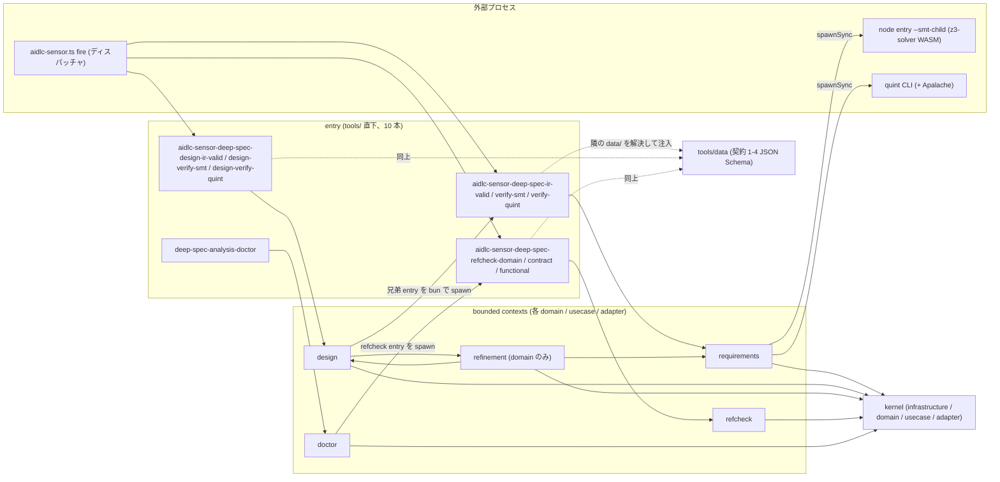
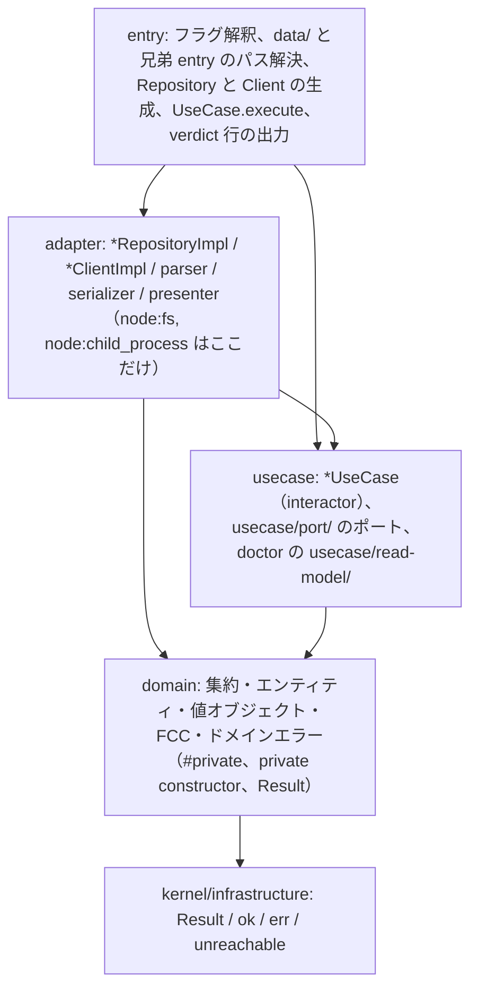
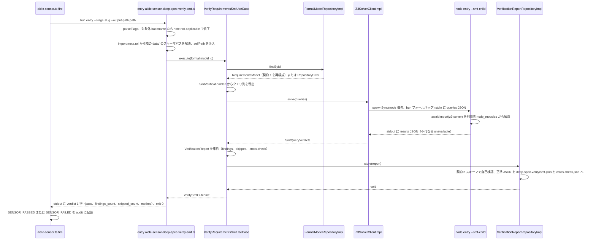
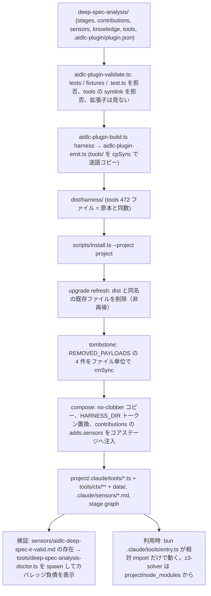

# deep-spec-analysis — アーキテクチャ

出典は developer link の handoff（`inception/reverse-engineering/developer-scan.md`。層別のファイル数・依存表・スパイク結果は実測）と `docs/decisions.ja.md`（設計判断記録）。層別の数字は `component-inventory.md`、依存表は `dependencies.md` に 1 回だけ載せ、ここでは参照する。

## Architecture Analysis

### System Overview

`deep-spec-analysis/tools/` は、AI-DLC のセンサーディスパッチャから起動される **10 本の CLI（entry: センサー 9 本＋doctor）** と、それらが共有する **6 つの bounded context × 最大 4 層のレイヤード実装（17 層ディレクトリ、468 `.ts`、24,306 行）**、および **4 本の契約スキーマ（`tools/data/*.json`）** から成る。サービスやデーモンは無く、すべて「1 回起動して JSON を 1 行返して終わる」プロセスである。ソルバーは常に子プロセス（z3 は `node` 上の `--smt-child`、Quint は `quint` CLI）として隔離される。

6 コンテキストの責務:

| コンテキスト | 責務 | 層 |
|---|---|---|
| `kernel` | 共有カーネル。published language（式ツリー `Expression` など 11 項目）、ドメインプリミティブ（`ContentHash`・`UnitName`・`FindingKind` …）、`Result` 型（infrastructure）、Repository/Clock ポート、CLI フラグ・JSON Schema 検証・YAML/Markdown 断片パーサ・SMT-LIB レンダリング補助（adapter） | infrastructure / domain / usecase / adapter |
| `requirements` | 契約 1（要件 IR）の集約 `RequirementsModel`、SMT／Quint 検証計画と判定、`VerificationReport`（契約 2）、IR 検証。z3 子プロセスと `quint` CLI のクライアント | domain / usecase / adapter |
| `design` | 契約 3（設計 IR）の集約 `DesignModel`、ユニットごとの lowering（契約 1 へのコンパイルダウン）、兄弟バックエンドの spawn と verdict の写像、`DesignReport`、設計 IR 検証、refinement 検査のクエリ組み立て | domain / usecase / adapter |
| `refinement` | 契約 4（refinement map）の集約 `RefinementMap` と `RefinementMapDefect`（ドメインエラー）、要件性質の alpha 置換計画。**domain 層のみ**（usecase／adapter は design が担う） | domain |
| `refcheck` | ソルバー不要の参照・構造検査。`Components`・`ContractRow`×`UnitDecls`・`DesignRecord` の不変条件と集約 `ReferenceCheckReport` | domain / usecase / adapter |
| `doctor` | インストール manifest、ソルバー可用性、検証カバレッジ、構造負債、設計カバレッジの健全性チェックとリードモデル（`usecase/read-model/`） | domain / usecase / adapter |

### Architectural Style

- **プラグイン内モジュラーモノリス × ヘキサゴナル（ports & adapters）**。各コンテキストは `domain`（エンティティ・値オブジェクト・ファーストクラスコレクション・ドメインイベント・ドメインエラー。`#private` フィールド、private constructor、`Result` で失敗を返す）→ `usecase`（interactor と `usecase/port/` のポート。CQRS のリードモデルは doctor の `usecase/read-model/`）→ `adapter`（Repository 実装、ソルバークライアント、パーサ、serializer、presenter）の縦割りで、`entry` が composition root として配線だけを持つ。証拠: 17 層すべてに `index.ts` facade があり、層間 import は 23 件の例外を除き facade 経由。`process.*`／`import.meta` の使用は entry 10 本に閉じ、`Bun.*` API は `tools/` 内 0 件。`tests/architecture/rules.ts` の 18 規則が方向と規律を機械検査する（規則名は `code-quality-assessment.md`）
- **依存方向**: 各コンテキストは kernel だけに依存し、コンテキスト横断は `SANCTIONED_CROSS_CONTEXT` の 4 辺（`refinement/domain → requirements/domain`、`refinement/domain → design/domain`、`design/usecase → refinement/domain`、`design/adapter → refinement/domain`）に限られる。パッケージ依存として非循環（`design/domain ← refinement/domain ← design/usecase`）。層単位の全エッジは `dependencies.md`
- **配布形態**: ライブラリでもサービスでもなく、AI-DLC プラグインの projection（`tools/` を逐語コピー）として利用先の `.claude/tools/` に置かれる CLI 群。ランタイムは bun、SMT 子プロセスだけ node ≥ 23

### Component Relationships


<!-- Text fallback: ディスパッチャ aidlc-sensor.ts fire が entry 10 本（requirements 系 3 本、design 系 3 本、refcheck 系 3 本、doctor）を起動する。各 entry は自コンテキスト（requirements / design / refcheck / doctor）の domain・usecase・adapter を配線し、隣の tools/data のスキーマパスを注入する。5 コンテキストはすべて kernel に依存し、refinement（domain のみ）は requirements と design の domain に、design の usecase と adapter は refinement の domain に依存する。requirements/adapter は z3 子プロセス（node、smt-child フラグ）と quint CLI を spawnSync し、design/adapter は兄弟 entry（verify-smt / verify-quint）を bun で spawn し、doctor/adapter は refcheck entry を spawn する。 -->

各コンテキスト内部の層は同じ形をとる（kernel だけが `infrastructure` を持ち、refinement は `domain` だけ）:


<!-- Text fallback: entry は adapter と usecase を配線し、adapter は usecase のポートを実装して domain を扱い、usecase は domain だけに依存し、domain は kernel/infrastructure の Result 型だけに依存する。I/O（node:fs、node:child_process）は adapter に閉じ、process.* と import.meta は entry に閉じる。 -->

### Data Flow

1. **要件検証**: `requirements.md` → ステージの LLM が `deep-spec-analysis-formal-model.md`（```json フェンス 1 つ＝契約 1 IR）を書く → `deep-spec-ir-valid` がスキーマ・`frRefs`・`sourceDigest` を検査 → `deep-spec-verify-smt` が IR を `RequirementsModel` に再構成し `SmtVerificationPlan` からクエリを組み立て、z3 子プロセスの判定を `VerificationReport` に集約し、契約 2 で自己検証してから `deep-spec-verify/smt.json` を書く（`quint.json` も同型。両者が `cross-check.json` にシナリオ判定を突き合わせる）→ ステージが `deep-spec-verify/*.json` を glob して `[Answer]:` 質問に変換する
2. **設計検証**: 各ユニットの `entities.md`・`rules.md`・`functional-spec.md` → LLM が `deep-spec-analysis-functional-formal-model.md`（契約 3）を書く → `deep-spec-design-ir-valid` → `deep-spec-design-verify-smt` / `-quint` がユニットごとに契約 1 文書へ lowering し、兄弟 entry を bun で spawn、返った verdict 文書を設計語彙（DOB／TR／SM／DSC）に写像。refinement map（契約 4、`deep-spec-analysis-refinement-map`）があれば要件性質を alpha 置換して z3 子プロセス（`childHostPath` に verify-smt entry を注入）で検査 → `deep-spec-design-verify/<backend>.json`
3. **refcheck**: `components.md` / `contract-summary.md` / `functional-design/*.md` → adapter のパーサが Markdown 断片（表・フェンス・YAML サブセット）を domain の宣言オブジェクトに再構成 → 宣言側の不変条件が `ReferenceCheckReport` に `finding`／`skip`／`input` を書く → `deep-spec-refcheck/{components,contract-summary,functional-design}.json`
4. **doctor**: harness ルート（`AIDLC_PROJECT_DIR`／`AIDLC_HARNESS_DIR`）→ manifest 照合 → ソルバー probe → intent ごとの検証カバレッジ（`sourceDigest` による陳腐化判定）→ refcheck entry を report-only で spawn した構造負債 → 設計カバレッジ → `{"checks":[...]}`

すべての永続化は Markdown／JSON ファイルで、DB もネットワークも無い（doctor の Apalache 陳腐化 probe が `localhost:8822` へ接続を試すのが唯一の通信）。

### Key Design Decisions

`docs/decisions.ja.md` に裁定として記録されているもののうち、構造を決めているものを挙げる（各項目は Context → Decision → Consequences の順、代替案は記録どおり）:

| 決定 | 文脈と判断 | 帰結 |
|---|---|---|
| コンパイルダウン再利用（設計検証フェーズ②） | 設計 IR 用に別バックエンドを書く代替を退け、ユニットを契約 1 文書に lowering して実績ある v1 バックエンドを子プロセスで再利用する | design/adapter が兄弟 entry のパス文字列（`.ts` 固定）を持つ。バックエンドは互いを import しない |
| z3 は必ず子プロセス（A1） | `z3-solver` の WASM は bun 上で pthread 起動アサーションで即死する（実測）。in-process 実行の代替は不可 | node 優先・bun フォールバック、どちらも不可なら `unavailable`。同じ entry が `--smt-child` で分岐する協定が外部仕様になった |
| 決定論と golden の byte 凍結（A1・A2） | 同じ IR から byte 同一の findings を契約にする | ソルバーの版は exact pin、`quint run --seed`、ITF の `#meta` 除去、正準ソート。版上げは golden 更新の裁定事項 |
| entry だけが `process.*`／`import.meta`／パス解決を持つ | センサーディスパッチャが basename で解決するため entry はフラット必須。層規律の免除ではなく「配線だけの役割」と定義 | 層は環境から独立し、bundle の入口を entry に限定する前提が既に満たされている |
| kernel/infrastructure 層（2026-08-30） | 手巻き `Result` のような「言語を拡張する基盤」はユビキタス言語でないので domain に置かない | 最内層として kernel だけが持つ。RPC・永続化は置かない |
| ドメインオブジェクトの種別規律と Tell-Don't-Ask（#71、2026-09-01〜03） | getter だけの型はデータモデルであり domain の住人ではない。4 種のドメインオブジェクト＋ドメインエラー以外は人間の裁定 | `no-data-models-in-domain`・`domain-fields-are-private` などの規則、published-language 表 1 つだけの免除（11 項目） |
| ポートは `usecase/port/`、リードモデルは usecase（2026-09-01／09-02） | Repository と Client の 2 種のポートを集める。表示・照会の投影は domain に置かない | doctor の `CoverageAssessment` 等が `doctor/usecase/read-model/` に移った |
| 1 公開型 1 ファイル（2026-09-01） | 公開型はファイルを 1 枚ずつ所有する | 468 ファイル・最大 395 行の粒度。facade `index.ts` が再輸出台帳になる |
| `sourceDigest` アンカー（v0.5.0） | IR を要件本文の正確なテキストに固定する | drift は検証時に拒否され、doctor の陳腐化判定も内容ハッシュで行う |
| 後方互換コードを持たない・tombstone で残骸を消す（PR2a 補遺） | 旧成果物を救う経路は持たず、アップグレード先の残骸は installer が消す | `scripts/install.ts` の `REMOVED_PAYLOADS`（ファイル単位）。intent-e2e が回帰網 |
| quint は SIGINT で止める（#128、2026-09-03） | SIGTERM では quint の後始末が走らず Apalache が孤児化する（実測）。`detached` は bun の `spawnSync` が無視するので採れない | `killSignal: "SIGINT"`、`ETIMEDOUT` を第一の証拠に。doctor は 8822 listen 時のみ trivial spec を verify |

### Improvement Opportunities

本 intent（`tools/` を `src/` と bundle に分離し、層の依存方向をパッケージ境界で強制する）に直結するものを優先する。根拠となる負債とリスクの一覧は `code-quality-assessment.md`。

1. **依存方向の強制をテスト時からパッケージ境界へ移す**: 現状は `layer-direction` 規則（テスト実行時）でしか検出できない。`src/<ctx>/<layer>/package.json`（`@deep-spec/<ctx>-<layer>`、`exports` は `index.ts` のみ、`dependencies` は許可層だけ `workspace:*`）＋ isolated linker で bare specifier の違反は実行時と tsc の両方で止まる（スパイク実測）。ただし相対パス import はパッケージ境界を素通りするので、「パッケージディレクトリを出る `../`」を禁じる規則を `only-sanctioned-imports` に足す必要がある
2. **facade を経由しない 23 本の直接 import を facade へ付け替える**: 引かれている名前はすべて対応する facade が再輸出済みなので機械的（内訳は `dependencies.md`）
3. **`.ts` 固定のパス文字列を 1 か所に集約する**: sensors manifest（9）、`sibling-backend-client-impl.ts`、design-verify-smt entry、`doctor-workspace-client-impl.ts`、`installation-manifest.ts` の台帳、stage 本文、`install.ts`、`smt-stress.ts`、README、テストに散在している。bundle 化（`.js` 10 本）はこの全部を書き換える変更面になる
4. **installer の tombstone をディレクトリ単位に**: refresh／tombstone がファイル単位・非再帰のため、bundle 化後は既存インストール先に `.ts` 468 本が孤児化する
5. **架構テストとカバレッジ設定の走査起点を `src/` に**: `walkToolsFiles` の symlink 拒否（isolated linker は各パッケージ直下に `node_modules` symlink を作る）と `bunfig.toml`／`tsconfig.include` の `tools/` 起点パターン
6. **残骸の除去**: `bunfig.toml` の存在しない除外 2 件、`rules.ts` 冒頭の古い LEGACY コメント

## Interaction Diagrams

### 1. センサーの発火（ディスパッチャ → entry → usecase → adapter → 子プロセスのソルバー → findings JSON）

`deep-spec-verify-smt` を例にとる。他のセンサーも「entry が配線し、usecase が集約を組み立て、adapter が I/O を担い、verdict 1 行を返す」形は同じで、Quint はソルバー子プロセスが `quint` CLI に、refcheck はソルバー呼び出しが無い点だけ違う。


<!-- Text fallback: ディスパッチャが bun で entry を stage オプションと output-path オプション付きで起動する。entry はフラグを解釈し（対象外の basename は note not-applicable で素通し）、import.meta.url から隣の data/ にあるスキーマパスと自分自身のパス（selfPath）を解決して Repository・Client・UseCase を配線し、execute を呼ぶ。UseCase は Repository から契約 1 の IR を RequirementsModel として取得し、SmtVerificationPlan からクエリを導き、Z3SolverClientImpl が node（無ければ bun）で同じ entry を smt-child フラグ付きで spawnSync し、stdin にクエリ JSON を渡す。子は利用先 node_modules の z3-solver を動的 import して解き、stdout に results JSON（不可なら unavailable）を返す。UseCase は判定を VerificationReport に集約し、Repository が契約 2 スキーマで自己検証した正準 JSON を deep-spec-verify/smt.json と cross-check.json に書く。entry は verdict 1 行を stdout に出して exit 0 で終わり、ディスパッチャが SENSOR_PASSED／SENSOR_FAILED を記録する。exit 1 は引数不備・書込失敗、exit 127 はソルバー不在。 -->

設計系センサー（`deep-spec-design-verify-*`）はこの図の U と C の間に「ユニットごとの lowering → `SiblingBackendClientImpl` が兄弟 entry（`aidlc-sensor-deep-spec-verify-<backend>.ts`）を bun で spawn → verdict 文書を設計語彙へ写像」が挟まり、refinement 検査では `RefinementSolverClientImpl` が `childHostPath`（design-verify-smt entry が注入した verify-smt entry のパス）を `--smt-child` で起動する。

### 2. projection ビルド → インストール → compose


<!-- Text fallback: 開発リポジトリ deep-spec-analysis/ を aidlc-plugin-validate.ts が検証し（tests・fixtures・.test.ts と tools 配下の symlink を拒否。拡張子は見ない）、aidlc-plugin-build.ts がハーネスごとに dist/ハーネス名/ を生成する（aidlc-plugin-emit.ts が tools/ を cpSync で逐語コピーするので 472 ファイルが同数で並ぶ）。scripts/install.ts（project オプション）は build の後、upgrade refresh（dist と同名の既存ファイルだけを削除）、tombstone（REMOVED_PAYLOADS の 4 件をファイル単位で削除）、compose（no-clobber コピー、HARNESS_DIR トークン置換、contributions の adds.sensors をコアステージの frontmatter へ注入）を行い、利用先の .claude/tools/ と .claude/sensors/ とステージグラフを更新する。最後にセンサー manifest の存在を確認し、doctor を spawn してカバレッジ負債を表示する。利用時は bun .claude/tools/ の entry が相対 import だけで動き、z3-solver は利用先の node_modules から解決される。 -->

この経路で **拡張子を見る工程は無い**（validate・emit・compose のいずれも）。したがって `.js` bundle＋`data/` を `tools/` に置く構成は projection／validate／compose を変えずに通る（handoff 負債 11、intent 前提と整合）。変わるのは installer の refresh／tombstone が旧 `.ts` を消せない点（負債 9）である。

## 関連成果物

- 層別のファイル数・行数・facade 再輸出数: `component-inventory.md`
- 層間・コンテキスト間の全依存エッジ、直接 import 23 本、配布時の依存前提: `dependencies.md`
- CLI 契約・子プロセス協定・スキーマ・環境変数: `api-documentation.md`
- 技術的負債 14 項目と本 intent のリスク 9 項目: `code-quality-assessment.md`
