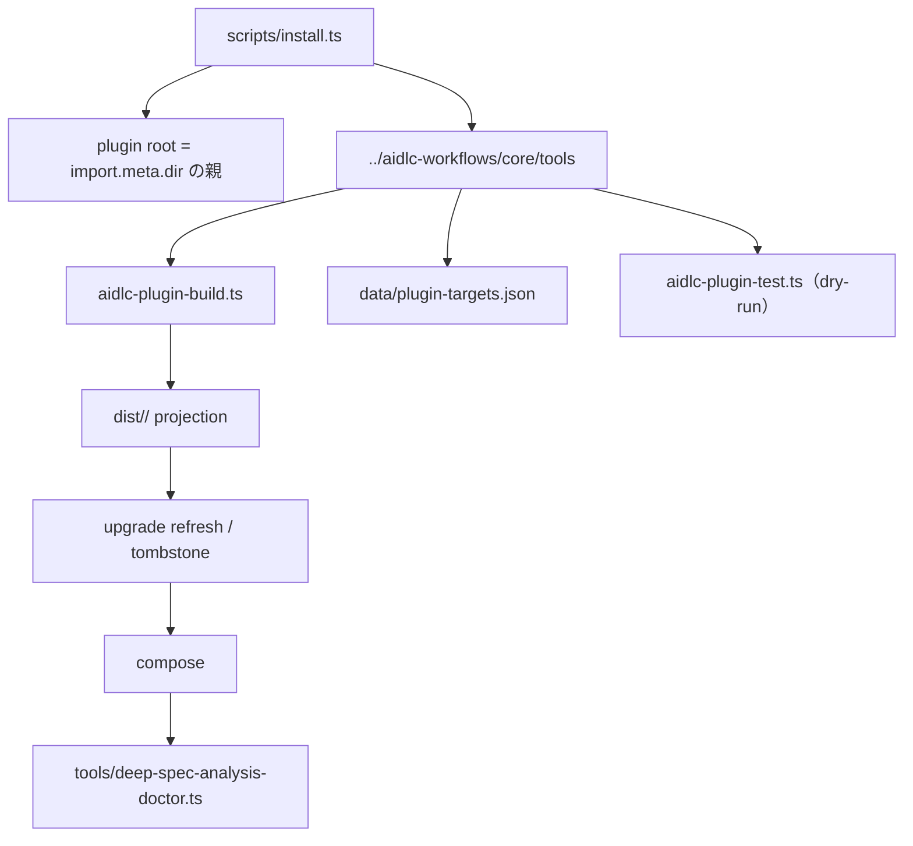

# deep-spec-analysis — 依存関係

## Focused scan 更新: installer の依存グラフ

現行 installer の checkout 依存は builder だけでなく、harness→leaf/kind の target data と dry-run の plugin test にも及ぶ。新しい source resolver だけを足しても、この3依存を導入先 toolchain へまとめて移さない限り submodule 不要にはならない。

### 目標依存と所有境界

| 境界 | 依存先 | 失敗時の契約 |
|---|---|---|
| source resolution | local filesystem または GitHub tags API／tarball | 取得・manifest/version 検証・build 完了までは導入先を変更しない |
| destination toolchain | `<project>/<harness>/tools/aidlc-plugin-build.ts`、target data、必要な plugin test | 不在なら本家 AI-DLC の導入不足を案内して停止 |
| install transaction | build 済み projection、導入先 filesystem、既存 compose | plugin-owned payload だけを refresh。tombstone は旧層ディレクトリを含め再帰削除し、provenance は除外 |
| provenance/update | `<harness>/tools/data/deep-spec-analysis-install.json`、source resolver | compose 成功後だけ atomic write。同版なら書き換え前に no-op |
| doctor version advisory | provenance reader と GitHub latest-tag query | ネット不可は非 blocking。既存 `{checks:[...]}` contract を壊さない表現が必要 |
| release | git working tree、manifest version、tag、remote | clean tree／commit／tag／push の順と途中失敗時の回復を明示する |

### 開発時と利用時の分離

- `.github/workflows/ci.yml` と `tests/plugin.test.ts` は validate／7 harness build のため `aidlc-workflows` submodule に依存し続けられる。
- installer runtime と新しい `--from`／`--update` E2E は、source checkout 側 submodule に依存しないことを別に証明する。
- `scripts/build-tools.ts` が作る bundle 10本＋schema 4本、`z3-solver` external、利用先の任意 solver runtime は既存契約として維持する。

以下の形式検証ランタイム全体の依存表は前回 store 由来で、今回の focused scan では package declaration と配布関連の辺だけを再確認した。

外部依存（npm と実行時の外部プロセス）と、内部の層間・コンテキスト間依存。内部の表は developer link が `.ts` 468 本・1,747 import を機械集計した実測で、ここに 1 回だけ載せる。版と pin の理由は `technology-stack.md`。

## 外部依存

| 種別 | 依存 | 使う場所 | 備考 |
|---|---|---|---|
| devDependencies | `@informalsystems/quint` 0.32.0、`@types/bun` 1.4.0、`typescript` 7.0.2、`z3-solver` 5.2.0 | 開発ハーネス（テスト・型検査） | すべて exact pin。`bun install --frozen-lockfile` |
| npm import（実行時） | `z3-solver` | `tools/requirements/adapter/z3-engine-child.ts:29` の `await import("z3-solver")` のみ | `ALLOWED_NPM` の唯一の項目。利用先の `node_modules` から解決される前提。bundle では `--external z3-solver` で残す |
| 外部プロセス | `node`（≥ 23）、`quint`、`java`（Apalache） | `requirements/adapter`（z3 子プロセス、quint CLI）、`design/adapter`（refinement ソルバー）、`doctor/adapter`（probe） | 不在は `unavailable`／`simulation` への縮退 |
| ワークスペース側 | `aidlc-workflows/`（submodule） | CI と `scripts/install.ts` の validate／build／emit、`tests/intent-e2e.test.ts` の `dist/claude` 導入、`tests/plugin.test.ts` | `tools/` 契約に拡張子の制約は無い（後述の「配布時の依存前提」） |

## 内部依存（層間・コンテキスト間の実 import エッジ）

すべて facade `index.ts` 経由か、次節の 23 件の直接 import。「層」は将来の package 候補（`@deep-spec/<ctx>-<layer>`）に対応する。

| 層 | 依存先の層 |
|---|---|
| `kernel/infrastructure` | （なし。node import も無し） |
| `kernel/domain` | `kernel/infrastructure` |
| `kernel/usecase` | （なし） |
| `kernel/adapter` | `kernel/infrastructure`、`kernel/usecase`（**`kernel/domain` を import しない**） |
| `requirements/domain` | `kernel/domain`、`kernel/infrastructure` |
| `requirements/usecase` | `requirements/domain`、`kernel/domain`、`kernel/infrastructure`、`kernel/usecase` |
| `requirements/adapter` | `requirements/domain`、`requirements/usecase`、`kernel/adapter`、`kernel/domain`、`kernel/infrastructure`、`kernel/usecase`、npm `z3-solver`（動的 import） |
| `design/domain` | `kernel/domain`、`kernel/infrastructure` |
| `design/usecase` | `design/domain`、`refinement/domain`、`kernel/domain`、`kernel/infrastructure`、`kernel/usecase` |
| `design/adapter` | `design/domain`、`design/usecase`、`refinement/domain`、`kernel/adapter`、`kernel/domain`、`kernel/infrastructure`、`kernel/usecase` |
| `refinement/domain` | `requirements/domain`、`design/domain`、`kernel/domain`、`kernel/infrastructure` |
| `refcheck/domain` | `kernel/domain`、`kernel/infrastructure` |
| `refcheck/usecase` | `refcheck/domain`、`kernel/domain`、`kernel/infrastructure`、`kernel/usecase` |
| `refcheck/adapter` | `refcheck/domain`、`refcheck/usecase`、`kernel/adapter`、`kernel/domain`、`kernel/infrastructure`、`kernel/usecase` |
| `doctor/domain` | `kernel/domain` |
| `doctor/usecase` | `doctor/domain` |
| `doctor/adapter` | `doctor/domain`、`doctor/usecase`、`kernel/domain` |
| entry（10 本） | 自コンテキストの domain／usecase／adapter ＋ `kernel/adapter` ＋ `kernel/domain`（design entry は加えて refinement 語彙を adapter 経由で使用。doctor entry は doctor 3 層のみ） |

- **コンテキスト横断エッジ**は `tests/architecture/rules.ts` の `SANCTIONED_CROSS_CONTEXT` 4 本と一致する: `refinement/domain → requirements/domain`、`refinement/domain → design/domain`、`design/usecase → refinement/domain`、`design/adapter → refinement/domain`。それ以外はすべて kernel 向き
- **非循環**: パッケージ依存として循環は無い（`design/domain ← refinement/domain ← design/usecase`）
- **node 組み込みの使用層**: entry `node:path`・`node:url`、`kernel/domain` `node:crypto` のみ、`kernel/adapter` `node:fs`・`node:path`、`requirements/adapter`・`design/adapter`・`doctor/adapter` `node:child_process`・`node:fs`・`node:os`・`node:path`、`refcheck/adapter` `node:fs`・`node:path`。`bun build` は `node:` 接頭辞を剥がして bare（`"path"`）にする（実測。bundle を規則の走査対象に入れてはいけない理由）

## facade を経由しない層またぎ import（23 本）

`exports` を `index.ts` に絞ると tsc／bun の両方で解決不能になるもの。**引かれている名前はすべて対応する facade が既に再輸出している**（各 `index.ts` を grep で確認）ので、facade／パッケージ名への付け替えは機械的。

| 出所 | 宛先 | 本数 |
|---|---|---|
| `tools/refcheck/adapter/{component-catalog-parser, contract-summary-parser, functional-design-parser, reference-check-report-repository-impl, reference-check-report-serializer}.ts` | `kernel/adapter/{fence, json, yaml, md-table, contract-schema, canonical-json, schema, schema-unreadable}.ts` | 16 |
| `tools/requirements/domain/{attribute-declaration（`export {AttributeBound} from` の再輸出を含む）, background-assumption, obligation, quint-machine-component, scenario}.ts` | `kernel/domain/{attribute-bound, expression}.ts` | 6 |
| `tools/refinement/domain/refinement-map-acquisition.ts` | `design/domain/design-input-anchor.ts` | 1 |

テスト側（17 テストファイル＋`tests/doubles/` 2 本）は `../tools/<ctx>/<layer>/index.ts` だけを import し、facade 以外への直接 import は 0 件。

## パッケージ境界で強制できること・できないこと（スパイク実測、bun 1.3.13）

本 intent の前提「宣言外の層を解決不能にする」の実測結果（`bun workspaces` ＋ `[install] linker = "isolated"` ＋ `exports: {".": "./index.ts"}` ＋ `dependencies: {"@spike/x": "workspace:*"}`）:

| ケース | 結果 |
|---|---|
| 宣言外パッケージの bare import | 実行時 `Cannot find module`、tsc `TS2307` で検出 |
| `exports` を迂回する深い import（`@spike/kd/inner.ts`） | 同上 |
| 相対パスで隣のパッケージディレクトリへ逃げる `../kd/inner.ts` | **実行時に通る**。現行 `only-sanctioned-imports` は `./`・`../` を無条件に許し、`layer-direction` が宛先を層に分類して裁いている（`rules.ts:189-207, 701-730`）。src/ 化後も「パッケージディレクトリを出る相対 import」を規則で禁じない限り、依存方向の強制は完成しない |
| entry と tests が workspace メンバーでない | `@deep-spec/*` を解決できず、`bun build` も `Could not resolve` で止まる。`entries/` を `workspaces` に加えて `dependencies` を宣言すると実行も bundle も通り、bundle に bare の `@spike/*` は 0 件（workspace パッケージはインライン化） |
| isolated linker の副作用 | 各 workspace パッケージ直下に `node_modules/@deep-spec/<dep>` の symlink が生える（ルート `node_modules` は `.bun/` のみ）。`tests/architecture.test.ts walkToolsFiles` は symlink で fail し、`node_modules` を除外していない |

## 配布時の依存前提

- projection（`aidlc-plugin-build.ts` → `aidlc-plugin-emit.ts`）は `tools/` を `cpSync` で **そのままコピー** する。フィルタは validate 側の `tests`／`fixtures` ディレクトリと `.test.ts` の拒否、`PLUGIN_SYMLINK_SCAN_DIRS`（`tools` を含む）の symlink 禁止だけで、**拡張子は見ない**（`aidlc-plugin-validate.ts validateTools` 938-956 行、浅読み）
- compose（`dist/claude/hooks/compose.ts`）は `{{HARNESS_DIR}}` 置換つきの no-clobber コピー。`tools/*.ts` にこのトークンは 0 件なので bundle には影響しない
- 利用先では `bun .claude/tools/<entry>.ts` が **相対 import だけ** で動き、`node_modules` は `z3-solver` 以外に無い前提。したがって `tools/` に置く出荷物は自己完結でなければならない（`@deep-spec/*` の bare specifier を残せない＝bundle でインライン化する必然）
- `scripts/install.ts` の upgrade refresh は「現 dist に同名で存在するファイル」だけを消し、tombstone は `REMOVED_PAYLOADS` にファイル単位で列挙したものを `rmSync(dst, { force: true })`（`recursive` 無し）で消す。dist の形が変わる（`.js` 10 本＋`data/`）と旧 `.ts` 468 本は残る

## 関連成果物

- 層の責務と数字: `component-inventory.md`
- 契約と子プロセス協定: `api-documentation.md`
- 上記の実測に基づく負債とリスクの一覧: `code-quality-assessment.md`
