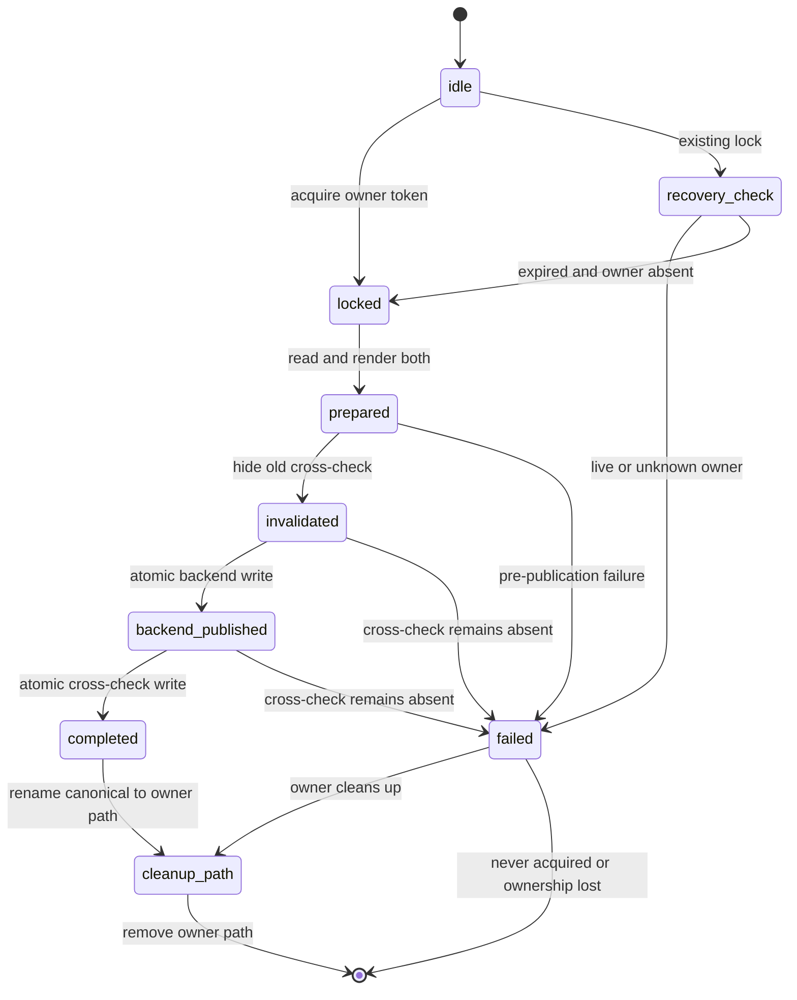
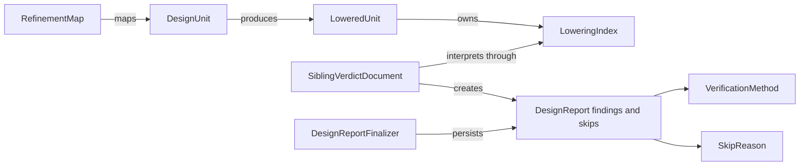

# Functional Specification — DDD／クリーンアーキテクチャ改善

## Scope and Guarantees

本設計は、確認済みの [`requirements.md`](../../inception/requirements-analysis/requirements.md) のFR1〜FR8を実装へ落とす。プラグイン本体は`deep-spec-analysis/`、zero-Unit修正は`aidlc-workflows/`のcanonical core・全harness生成物・回帰試験・リリース情報と現在の`.codex/tools/`導入コピーを対象とする。本家互換、契約1〜4、findings JSON、stdout verdict、文言、正準順、golden bytes、solver pinを維持する。

保証を次の二層に分ける。

- **保証する**: 各JSONファイルは途中bytesを公開しない。同じdirectoryの協調writerは直列化する。処理失敗を`verified`へ変換しない。新backendを公開する前に古いcross-checkをpublic pathから外す。
- **保証しない**: 契約を変えず、lockを取らない外部readerに対して、backend reportとcross-checkを同一瞬間に切り替えること。プロセスクラッシュ時はstaleなcross-checkではなくcross-check欠落を許容し、次の成功実行で再構築する。

## Component Responsibilities

| Component | Layer | Responsibility | Must not own |
|---|---|---|---|
| `DesignReportFinalizer` | design/usecase | Repositoryのconformanceを一度だけ呼び、同じ適合済みreportの保存成功後にverdict summaryを返す | schema読込、filesystem、lock、backend固有solver判断 |
| `DesignReportRepository` | design/usecase port | `conformedOf`による適合と、既に適合したreportのfinalizationを別コマンドで表現 | schema path、具体的filesystem操作、同じreportの再conformance |
| `DesignReportRepositoryImpl` | design/adapter | immutable schema snapshotによるconformance、directory lock、candidate render、stale先行無効化、atomic writes | SMT／Quint固有判断、store時の再conformance |
| `DirectoryFinalizationLock` | design/adapter | owner token、PID、30秒lease、非待機取得、liveness確認、token fencing、owner固有cleanup/stale path | domain判断、待機、再試行、canonical pathの直接削除、外部向け文言 |
| `VerifyDesignSmtUseCase` | design/usecase | SMT lowering、solver、refinement query、budget | 共通finalizationの複製 |
| `VerifyDesignQuintUseCase` | design/usecase | Quint run、reachability probe、refinement extras、budget | 共通finalizationの複製 |
| `DesignVerificationAcquirer` | design/usecase | model取得、not-found／I/O／unreadableの分類、IR version mismatch reportのfinalization、取得専用5 variantへの結果制限 | backend mode boolean、solver、probe、refinement、成功／backend固有outcome、`unknown` payload、optional hook |
| `DesignUnit`／宣言群 | design/domain | loweringの意味と生成順 | sibling document variantの解釈 |
| `LoweredUnit` | design/domain | lowered collectionsとindexの不変条件 | build orchestration、verdict remap |
| `SiblingVerdictDocument` | design/domain | document variantと`LoweringIndex`によるDesign結果への解釈 | filesystem parser、backend execution |
| `VerificationMethod`／`SkipReason` | kernel/domain | 閉集合、strict parse、逐語reconstitute | I/O、表示文言 |
| `usesStageLevelPerUnitArtifacts` | aidlc-workflows core | 解決済みUnit集合がゼロ件のstage-level path判定を質問・review・traceabilityへ共有 | stage固有の特例、artifact本文の解釈 |

## Workflow 1: Report Finalization

1. SMT／Quint usecaseがbackend固有の検証を終え、未適合の`DesignReport`を組成する。
2. `DesignReportFinalizer`がRepository portの`conformedOf(report)`を一度だけ呼ぶ。schema pathとsnapshotはRepository adapterだけが所有し、Finalizerへ公開しない。
3. Finalizerは適合済みreportから返却用のpass／findings count／skipped countを導出する。ただし永続化成功までは`verified`を返さない。
4. Repositoryの`storeConformed`へ適合済みreportと`DesignModel`を渡す。`storeConformed`はschema conformanceを再実行せず、同一directoryのfinalizationを開始する。
5. Adapterは128-bit以上のランダムowner token、PID、取得時刻、30秒後のlease期限を持つdirectory lockをcanonical pathへ単発でexclusive createする。既存lockがあれば待機・再試行しない。
6. 既存lockはlease期限切れだけでは奪取しない。OS liveness probeが記録PIDの不在を確定でき、metadataを再読してtokenが不変な場合だけ、canonical lock directoryを`<lock>.stale.<old-token>.<new-token>`へatomic renameする。PIDがlive、権限等で不明、またはtokenが変化した場合は`lock-contended`として失敗する。
7. 複数の回復writerが競合した場合、stale renameと続くcanonical pathのexclusive createに勝った一つだけが新ownerになる。rename後のcreateに負けたwriterは自分が作ったstale pathだけを掃除し、canonical pathへ触れず`lock-recovery-failed`で終了する。
8. Lock内でcross-checkを除く兄弟reportを読み、同じbackendの旧reportをcandidateで置換した`DesignReports`を作る。
9. Candidate backend bytesとcandidate cross-check bytesを両方renderする。ここまでの失敗では公開ファイルを変えない。
10. 既存`cross-check.json`の無効化、backend reportのrename、新cross-checkのrenameの直前ごとに、lock metadataが`held`かつowner tokenが自分と一致することを検査する。不一致ならそれ以降のpublishを行わない。
11. 既存`cross-check.json`を同一directoryの非公開stale名へatomic renameし、public pathから先に外す。
12. Canonical atomic-write helperでbackend reportをtemp fileからrenameする。
13. Canonical atomic-write helperで新しい`cross-check.json`をtemp fileからrenameする。
14. `finally`でcanonical metadataのtoken一致を確認し、canonical lock directoryを`<lock>.cleanup.<owner-token>`へatomic renameする。rename成功後はそのowner固有pathだけを削除し、canonical pathを二度と削除しない。renameに負けた場合もcanonical pathを削除せず`lock-release-failed`とする。cleanup path削除だけの失敗は後続ownerを妨げず、次回起動時にcanonical lockとは別に掃除する。
15. 両公開とcleanupに成功した場合だけFinalizerが`verified` outcomeを返す。

### Failure Matrix

| Failure point | Public backend | Public cross-check | Outcome | Recovery |
|---|---|---|---|---|
| live lock取得 | old | old | `save-failed`（内部原因`lock-contended`） | 待機せず終了。独立directoryは継続可能 |
| expired lock回復競合 | old | old | `save-failed`（内部原因`lock-recovery-failed`） | 新ownerを壊さず終了 |
| live ownerが30秒超停止 | old | old | `save-failed`（内部原因`lock-contended`） | PIDがliveなので奪取せず、旧writerだけが再開可能 |
| lock／sibling read／render前 | old | old | `save-failed` | 変更なし |
| stale rename失敗 | old | old | `save-failed` | 変更なし |
| stale rename後、backend前 | old | absent | `save-failed` | 次回にold sibling setから再構築 |
| backend公開後、cross-check前 | new | absent | `save-failed` | 次回にnew sibling setから再構築 |
| cross-check公開後、cleanup rename前 | new | new | cleanup失敗を返す | canonical lockが残る。process終了後は期限とPID不在を確認して回復 |
| owner固有cleanup path削除失敗 | new | new | cleanup失敗を返す | canonical pathは空いており後続writerは取得可能。owner固有pathだけを後で掃除 |

古いcross-checkをrestoreしてよいのはbackendがまだoldであると同じlock内で証明できる場合だけである。backend公開後にはrestoreしない。非公開stale名は`*.json`にせず、既存の兄弟report列挙へ混入させない。64 KiBの2文書をtemp＋renameするローカル実測1,000回はp99 0.534 ms、最大2.026 msだった。30秒leaseは回復判定を開始できる時刻にすぎず、live ownerの死亡証明には使わない。時計とPID liveness probeは注入し、境界値とlive停止を実時間待ちなしで検証する。

### State Machine: ReportFinalization

<!-- Text fallback: ReportFinalizationは既存lockがあればlive ownerを確認し、期限切れかつowner不在の場合だけowner固有stale pathへ移して回復する。両candidateを準備し、各公開直前にtokenを検査してbackendとcross-checkを順に公開する。完了・失敗ともcanonical lockをowner固有cleanup pathへ移し、そのpathだけを削除する。 -->

## Workflow 2: Strict Creation and Tolerant Hydration

1. 正常なdomain生成は`FindingKind`、`VerificationMethod`、`SkipReason`のstrict `parse`／`of`を呼ぶ。
2. 閉集合外の値はdomain errorを持つ`Result`となり、finding／skip／reportを生成しない。
3. Domain factoryは検証済みDPを受け取り、内部で任意文字列を`reconstitute`しない。
4. Adapterが既存・外部文書を読む場合だけ`tolerant reconstitute`を使い、未知値を逐語で保持する。
5. 未知finding kindは既存fallback rankで末尾へ並び、schema conformanceで従来どおり降格する。

正常生成とhydrationのAPIは名前で区別し、同じfactoryにboolean modeやoptional validation flagを追加しない。

## Workflow 3: Refinement Package Integration

1. `src/refinement/domain/*.ts`のうち`index.ts`を除く36ファイルを`src/design/domain/`直下へ移す。公開symbolを`design/domain/index.ts`へ明示追加する。
2. 15個のTypeScript参照を`@deep-spec/design-domain`または同一package内relative importへ変更する。
3. `design/usecase`、`design/adapter`、`tests`の3依存manifestから`@deep-spec/refinement-domain`を除去する。
4. `src/refinement/domain/package.json`と空になった旧directoryを削除し、互換shimを作らない。
5. `SANCTIONED_CROSS_CONTEXT`から旧4辺を削除し、Design domainからRequirements domainへの必要な一方向edgeだけを明示・検査する。
6. Architecture red exampleで旧Refinement package importを拒否し、実ツリーとmanifestのgreenを確認する。
7. Refinement goldenと設計検証goldenをbyte比較し、意味・文言・順序が変わっていないことを確認する。

移動後も`refinement-map.ts`、`refinement-status.ts`等の既存名を保つ。`design/domain/refinement/`という例外階層は作らない。

## Workflow 4: Lowering and Verdict Ownership

1. `buildLowering`の採番、候補生成、machine／scenario／background loweringを、`DesignUnit`および既存宣言objectの振る舞いへ移す。
2. `DesignUnit`は必要なlowered collectionsと`LoweringIndex`を組成し、`LoweredUnit`の検証済み生成口へ渡す。
3. `LoweredUnit`はcollections、index、refinement追加時の一貫した再構成だけを所有する。
4. `remapVerdicts`のdocument variant分岐、synthetic finding、waiver、dedupeを`SiblingVerdictDocument`へ移す。
5. `SiblingVerdictDocument`は`LoweringIndex`と`DesignUnit`の識別・名前を使い、既存`DesignFinding`／`DesignSkipped`をbyte同一で返す。
6. 本番6呼出点とテスト20呼出点を新しい所有APIへ更新する。

新しいdomain service、自由関数、pass-through wrapperは追加しない。移動後の概算は`DesignUnit`約288行、`SiblingVerdictDocument`約192行、`LoweredUnit`約88行であり、1,000行境界を十分下回る。

## Workflow 5: Common Usecase Collaboration

1. `DesignVerificationAcquirer.acquire`は`modelId`、呼出側が生成した`DesignReportId`、strictに生成済みの初期`VerificationMethod`だけを受け取る。backend名文字列、mode boolean、`unknown` payload、optional hookは受け取らない。
2. `DesignModelRepository.findById`の結果を一度だけ分類する。`not-found`はterminal `not-applicable`、I/O失敗はterminal `acquisition-failed`とする。
3. unreadable入力は初期methodを使った既存`DesignReport.irUnreadable`を作り、`DesignReportFinalizer`で保存して、成功時はterminal `model-unreadable`、保存失敗時はterminal `save-failed`を返す。
4. 読めたmodelが`SUPPORTED_DESIGN_IR_MAJOR`を満たさない場合は既存`DesignReport.versionMismatch`をFinalizerで保存し、同じ適合前skip countを持つterminal `version-mismatch`を返す。
5. 対応versionなら`ready`として同じ`DesignModel`と`ContentHash`を返す。ここが共通境界の終端であり、SMT／Quint usecaseはこの結果からbackend固有処理へ戻る。
6. SMTのsolver query、synthetics、refinement deadlineはSMT usecaseに残す。
7. Quintのmethod更新、reachability probe、probe cap、refinement extrasはQuint usecaseに残す。
8. Report finalizationの重複は`DesignReportFinalizer`一か所へ移し、`DesignVerificationAcquirer`からも両backend usecaseからも同じものを利用する。

返却契約は次のusecase内部型で閉じる。

- `DesignAcquisitionTerminal = Extract<VerifyDesignOutcome, { kind: "not-applicable" | "acquisition-failed" | "model-unreadable" | "version-mismatch" | "save-failed" }>`
- `DesignAcquisitionResult = { kind: "ready"; model: DesignModel; irHash: ContentHash } | { kind: "terminal"; outcome: DesignAcquisitionTerminal }`

`VerifyDesignOutcome`全体をterminal memberへ入れてはならない。両backend usecaseは`ready`と`terminal`をexhaustiveに分岐し、`terminal`はそのまま返し、`ready`だけがsolver／probe／refinementへ進む。compile-timeの`never`検査と5 terminal variantのtable testにより、成功やbackend固有outcomeをAcquirerが返せないことを証明する。これは新しいdomain objectではなく外部へ露出しないusecase結果型である。

## Workflow 6: Zero-Unit Stage-Level Artifacts

1. `usesStageLevelPerUnitArtifacts`はcompiled stateから解決されたUnit集合がゼロ件かを判定する。Units Generationが実行済みか`SKIP`かは条件にしない。
2. `summaryQuestionFiles`はこの共有判定が真なら`construction/<stage>/<stage>-questions.md`を返し、per-Unit directoryを探索しない。
3. `checkSummaryConfirmationEvidence`はstate contentを同じ判定へ渡し、stage-level questionsの最新digestと`Looks correct`を検証する。
4. traceability sensorは`functional-design`、`nfr-requirements`、`nfr-design`、`infrastructure-design`、`code-generation`でUnit名を導出せず、stage-level pathから上流requirementsと同階層rulesを解決する。
5. 正本の`aidlc-workflows/core/`だけを手修正し、`bun scripts/package.ts`で全harness配布物を再生成する。現在のIntent継続用にroot `.codex/tools/`の対応2ファイルも同期する。
6. `t281-sensor-traceability.test.ts`と`t320-review-confirmation-deadlock.test.ts`を、実行済み／`SKIP`のzero-Unitと既存per-Unit非退行を含むmatrixとして実行する。
7. package drift check、全test、typecheckを通し、version、README badge、CHANGELOGを同じversionへ更新する。

## Entity Relationship View

<!-- Text fallback: DesignUnitがLoweredUnitを生成し、LoweredUnitはLoweringIndexを所有する。SiblingVerdictDocumentはそのindexを通じてDesignReportのfindingとskipへ解釈する。RefinementMapはDesignUnitを要件へ対応づけ、DesignReportはVerificationMethodとSkipReasonを使う。DesignReportFinalizerが適合済みreportを永続化する。 -->

## Rules Summary

| Rules | Behaviour |
|---|---|
| BR1.1–BR2.7 | Repository conformance一回、失敗伝播、非待機lock、lease回復、stale先行無効化、個別atomic write |
| BR3.1–BR3.2 | strict creationとtolerant hydration |
| BR4.1–BR4.2 | Refinementのflat統合、shimなし、byte互換 |
| BR5.1–BR5.2 | 共通変更理由だけをapplication collaboratorへ集約 |
| BR6.1–BR6.4 | LoweredUnit、DesignUnit、SiblingVerdictDocumentの責務分離 |
| BR7.1–BR7.3 | 本家互換、意思決定記録、architecture gate維持 |
| BR7.4–BR7.6 | 回帰matrix、未信頼入力／path境界、production file 1,000行上限 |
| BR8.1–BR8.4 | zero-Unitのstage-level質問・review・traceabilityと配布同期 |

## Security and Compliance

- 未信頼JSON／Markdownの検証はadapter境界に残し、strict creation導入を理由に寛容な外部文書処理をdomain正常系へ混ぜない。
- Lock、temp、stale fileのpathは`DesignReportId.directory()`と固定basenameからだけ導出し、入力文字列で任意pathを組み立てない。
- 非公開temp／stale fileは兄弟`*.json`列挙に含めず、成功・失敗後にbounded cleanupする。
- 検証結果と保存証跡が食い違う場合は成功を返さず、監査対象のverdictを偽らない。
- Zero-Unit解決はartifact本文を命令として解釈せず、compiled stateと既知のstage契約だけからpathを決める。

## Verification Matrix

| Obligation | Verification |
|---|---|
| schema二重観測 | `conformedOf`呼出し回数と`storeConformed`の非再conformanceをtest doubleで検証 |
| report/cross-check failure | read、invalidate、backend write、cross-check write、cleanupをfault injection |
| concurrent writers | live lease即時失敗、30秒超停止したlive PIDの非奪取、期限切れ＋PID不在回復、publish各点のtoken fencing、回復競合、canonical→owner cleanup renameと後続exclusive createの全interleaving、異directory非干渉 |
| strict/tolerant boundary | 新規未知値は`Result` error、hydration未知値は逐語保持と降格 |
| Refinement integration | old import 0件、manifest 0件、architecture red/green、golden byte比較 |
| zero-Unit | stage-level questions、review confirmation、traceabilityを実行済み／`SKIP`の双方で検証し、per-Unitを非退行確認 |
| trust/path | 未信頼JSON／Markdownのadapter検証と`DesignReportId`外path拒否 |
| maintainability | 変更したproduction fileがすべて1,000行未満であることを機械検査 |

## Decisions and Alternatives

| Decision | Selected | Rejected alternatives | Evidence |
|---|---|---|---|
| Refinement配置 | `design/domain/`直下 | 例外的subdirectory、旧package維持 | 85＋37ファイル、衝突は`index.ts`のみ |
| Cross-check failure | stale先行無効化 | backup rollback、通知のみ | 故障注入でrollbackは捕捉例外だけ成功し、クラッシュ相当ではnew／old不整合 |
| Package migration | shimなし | 一時／恒久shim | TS参照15、依存manifest 3、private package |
| LoweredUnit分離 | 既存意味所有者へ移管 | 現状維持、新domain service | build 161行、remap 135行、移管先は127行／57行 |
| Schema conformance owner | Repositoryの`conformedOf`を維持し、Finalizerから1回だけ呼んで`storeConformed`へ渡す | 新conformance port、store内再conformance | productionは3 repository実装・7 usecase呼出し・3 store内再評価。既存裁定を維持し、今回の二重評価だけを除去 |
| Directory lock | owner token＋PID liveness＋owner固有stale/cleanup path＋publish前fencing＋30秒lease | canonical pathの直接削除、無期限待機、leaseだけの強制解除、lockなし | 64 KiB×2文書の1,000回実測はp99 0.534 ms、最大2.026 ms。cleanup対象をtoken固有pathへ固定し、後続ownerのcanonical lockを削除不能にする |
| Common acquisition | `DesignVerificationAcquirer`の閉じたready／terminal結果 | generic backend pipeline、両usecaseへの残置 | SMT／Quint冒頭のmodel取得・3失敗分類・version mismatchが同形。backend固有処理はready後に分岐 |
| Zero-Unit path | 共有判定でstage-levelへ解決 | stage別特例、架空Unit、per-Unit強制 | 実測した失敗はquestions/reviewとtraceabilityの2経路。回帰試験22件が修正後green |

## Assumptions & Open Questions

None.

## Sources

- `aidlc/spaces/default/intents/260904-ddd-clean-architecture/inception/requirements-analysis/requirements.md`
- `aidlc/spaces/default/intents/260904-ddd-clean-architecture/construction/functional-design/functional-design-questions.md`
- `aidlc/spaces/default/codekb/deep-spec-analysis/architecture.md`
- `aidlc/spaces/default/codekb/deep-spec-analysis/code-structure.md`
- `deep-spec-analysis/src/kernel/adapter/atomic-write.ts`
- `deep-spec-analysis/src/design/adapter/design-report-repository-impl.ts`
- `deep-spec-analysis/src/design/domain/lowered-unit.ts`
- `deep-spec-analysis/src/design/domain/design-unit.ts`
- `deep-spec-analysis/src/design/domain/sibling-verdict-document.ts`
- `aidlc-workflows/core/tools/aidlc-lib.ts`
- `aidlc-workflows/core/tools/aidlc-sensor-traceability.ts`
- `aidlc-workflows/tests/unit/t281-sensor-traceability.test.ts`
- `aidlc-workflows/tests/unit/t320-review-confirmation-deadlock.test.ts`

## Review

**Verdict:** READY
**Reviewer:** aidlc-architecture-reviewer-agent
**Iteration:** 1
**Request Challenge:** review:9e571021b4cc9c2d5953e422a87eef16

### Validation Evidence

- Traceability sensor: `pass:true`; gaps, orphans, missing upstream IDs, and invalid targets are empty.
- Required-sections sensor: `pass:true` for `entities.md`, `rules.md`, and `functional-spec.md` before this terminal review appendix was added.

### Findings

#### R-01 — Resolved: parent requirement coverage

- **Status:** Resolved
- **Severity:** BLOCKER (prior)
- **Evidence:** `traceability.json` includes `FR1` through `FR8`, every child FR, and `NFR1` through `NFR5`; the traceability sensor reports zero findings.
- **Required action:** None.

#### R-02 — Resolved: conformance ownership

- **Status:** Resolved
- **Severity:** HIGH (prior)
- **Evidence:** The preserved Repository-boundary `conformedOf` ruling remains consistent: the adapter owns one immutable schema snapshot, the Finalizer invokes conformance exactly once, and `storeConformed` persists the exact conformed report without another schema observation.
- **Required action:** None.

#### R-03 — Resolved: lock publication and cleanup safety

- **Status:** Resolved
- **Severity:** CRITICAL (prior)
- **Evidence:** A held lock cannot be recovered from lease expiry alone; PID absence must be definite and the token must remain unchanged. Every public rename is fenced by the current held token. Release now atomically moves the canonical lock directory to `<lock>.cleanup.<owner-token>` and deletes only that owner-specific path, explicitly forbidding any later canonical-path deletion. Stale recovery paths include both old and contender tokens, and competing recovery/create operations leave at most one canonical owner. Cleanup-path deletion failure cannot block or remove a successor lock, while cleanup-rename failure leaves the canonical lock fail-closed for later dead-owner recovery. The Verification Matrix covers a paused live owner, dead-owner recovery, per-publication fencing, recovery races, release failure, and directory isolation.
- **Required action:** None.

#### R-04 — Resolved: NFR mapping

- **Status:** Resolved
- **Severity:** HIGH (prior)
- **Evidence:** BR7.4–BR7.6 and the Verification Matrix retain explicit coverage of NFR3 regression scenarios, the NFR4 trust/path boundary, and the NFR5 production-file ceiling; their traceability targets validate successfully.
- **Required action:** None.

#### R-05 — Resolved: closed acquisition contract

- **Status:** Resolved
- **Severity:** HIGH (prior)
- **Evidence:** `DesignVerificationAcquirer.acquire` now has exactly three inputs: `modelId`, caller-created `DesignReportId`, and a strict initial `VerificationMethod`. `DesignAcquisitionTerminal` narrows `VerifyDesignOutcome` with `Extract` to exactly `not-applicable`, `acquisition-failed`, `model-unreadable`, `version-mismatch`, and `save-failed`. `DesignAcquisitionResult` exposes only that terminal set or `ready` with `DesignModel` and `ContentHash`; only `ready` crosses back to solver/probe/refinement logic. A compile-time `never` check and five-variant table test enforce exhaustiveness without creating a new domain object or changing public outcomes.
- **Required action:** None.

### Summary

All five carried findings are resolved. The design now preserves the existing conformance ruling and public compatibility surface, defines a fail-safe single-owner lock protocol, closes the common acquisition boundary, covers zero-Unit behavior for executed and skipped Units Generation, and passes both required validation classes. No new findings were identified.
