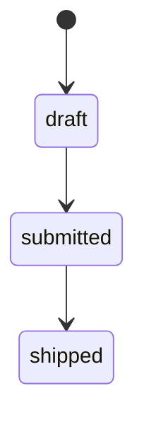

# Functional Spec — u1-orders

## Workflows

1. Submit order: validate amount (BR1.1), mark submitted.
2. Ship order: check status (BR1.2), mark shipped.

### State Machine: Order

```mermaid
stateDiagram-v2
    [*] --> draft
    draft --> submitted
    submitted --> shipped
```
