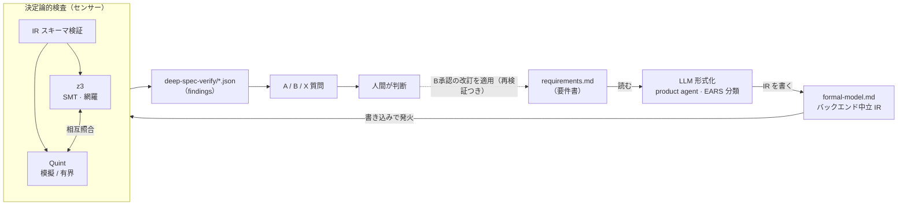
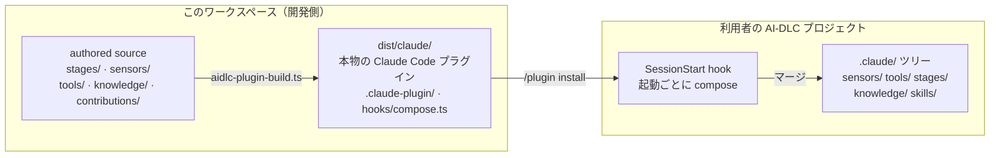

# Deep Spec Analysis のしくみ

[English](architecture.md) | 日本語

要件書を LLM が形式化し、ソルバーが決定論的に検査し、発見は必ず人間の二択に戻す——ニューロシンボリック要件検証を [AI-DLC v2](https://github.com/awslabs/aidlc-workflows) に足すプラグイン。core は一切変更しない。

- プラグイン: `aidlc-deep-spec-analysis@aidlc-plugins`
- バックエンド: SMT (z3) + Quint
- 決定論: 同一 IR + 同一環境 ⇒ バイト一致の出力

## §1 ニューロシンボリックのループ

確率的な仕事（自然言語の形式化）は LLM に、決定論的な仕事（矛盾・完全性・シナリオの検査）はソルバーに割り当てる。両者の受け渡し点がバックエンド中立の IR で、検査結果は人間の判断（A/B/X）を経てのみ要件に還流する——B承認された改訂はステージが適用し、再検証まで行う。



要件はループを一周して人間に戻る。B（改訂案採用）と答えた改訂はステージが `requirements.md` に適用し、センサーを再実行して解消を確認する。無断の書き換えはない——適用されるのは人間が承認した文面だけで、決定論的なセンサー群自体は読み取り専用。

## §2 ステージの実行順序

Inception フェーズに `deep-spec-analysis-verify` ステージとして挿し込まれ、次の順で進む。なおステージは `scopes: [enterprise, feature]` を宣言しているため、この2スコープの intent でのみ実行される（`classic` スコープの intent ではエンジンが SKIP に振る——実 intent で確認済みの仕様）。

**後入れ対応**：compose は追加合成なので、AI-DLC 運用中のプロジェクトへ途中からインストールしても機能する。導入前から存在する intent に対しても `/aidlc --stage deep-spec-analysis-verify --single`（compose される `/deep-spec-analysis-verify` スキルと同じもの）で、ワークフローを進めずに既存の requirements.md へ検査だけをかけられる。findings はその intent のレコード配下に書かれる。制約はスコープのみ（classic は single モードでも拒否）。さらに**検査漏れの把握は自動**：インストーラは導入直後にカバレッジスキャンで未検査 intent を実行コマンド付きで列挙し、以後は `/aidlc --doctor` が「N/M eligible intents verified」の行と未検査・stale（検査後に要件が変更された）intent の advisory 行を出し続ける。この後入れ経路は検出機構込みで `tests/intent-e2e.test.ts` が毎回回帰検証する。

1. **形式化** — product agent が各 FR / NFR を EARS 分類し、IR を `deep-spec-analysis-formal-model.md` の単一 JSON フェンスに書き込む。
2. **センサー発火** — 書き込みを検知して 3 センサーが順に走る：IR スキーマ検証 → SMT（z3）→ Quint。findings は `deep-spec-verify/*.json` に書かれる。
3. **人間ゲート** — ステージが findings を質問に変換する — **A.** 現状維持 / **B.** 改訂案を採用 / **X.** その他。全件が人間の回答を待つ。
4. **改訂の適用** — Bで承認された改訂をステージが `requirements.md` に適用し（承認文面のみ・verbatim）、形式化とセンサーを再実行して解消を確認する。
5. **レポート** — `deep-spec-analysis-report.md` にカバレッジ表（義務 × バックエンド）と、適用済み改訂の before/after・第2パス検証結果が並ぶ。

## §3 何を検査し、何を約束するか

| 検査 | 内容 |
|---|---|
| 矛盾 (contradiction) | 要件同士が同時に満たせない組み合わせを SMT が網羅的に探す |
| 完全性ギャップ (completeness) | どの要件も挙動を定めていない入力領域の穴を検出する |
| シナリオ違反 (scenario) | 期待シナリオの成立を両バックエンドで検証し、判定を相互照合して形式化ミス自体も炙り出す |

沈黙のギャップは作らない——各義務は必ず次の 4 状態のいずれかとしてカバレッジ表に現れる。

| 状態 | 意味 |
|---|---|
| `checked` | 検査済み |
| `skipped` | 理由付きスキップ |
| `unavailable` | ソルバー不在 |
| `unverified` | 未検証と明示 |

ソルバーが無くてもステージは止まらず、助言的 finding と `/aidlc --doctor` のヒントに落ちる。決定論も約束のひとつ：同じ IR と同じ環境なら出力はバイト一致する（固定シード・正準ソート・タイムスタンプなし）。conformance テストがバイト単位で担保する。

## §4 配布 — ビルドから compose まで

ビルド成果物はハーネスごとの「本物のホストプラグイン」。Claude Code なら通常のプラグインとして導入し、セッション開始時の hook がプロジェクトの `.claude/` ツリーへ合成（compose）する。



最短の導入は同梱インストーラ：`bun deep-spec-analysis/scripts/install.ts --project <project> [--harness claude]` が build → compose を一括実行する（store系ハーネスは `dist/` から直接 compose しプロジェクトへは何もコピーしない。ストアなしの Kiro / Kiro IDE / Cursor のみ、ホストの流儀どおり projection をプロジェクトルートへフォルダドロップしてから compose。`--dry-run` で事前検証。compose は冪等なので再実行も安全）。ストア経由なら Claude Code は `/plugin marketplace add` + `/plugin install aidlc-deep-spec-analysis@aidlc-plugins`、Codex CLI なら `dist/codex/` を対象に `codex plugin marketplace add` + `codex plugin add aidlc-deep-spec-analysis@aidlc-plugins`（初回のみ hook の信頼承認。hook は最初の対話で遅延発火し、`.codex/` ツリーへ compose する）。ストアを持たないハーネス（Kiro など）は手動コピー：`dist/<harness>/` をプロジェクトへ `cp` で投下し、`aidlc plugin sync`（または hook の `compose.ts` を直接 bun 実行）で compose する。この経路には導入時の信頼ゲートがなく、コピーすること自体が信頼の判断になる点に注意。手順は [README](../README.ja.md) の Quickstart。プロジェクトの外には何も置かれず、無効化すれば vanilla に再 compose される——core は無改変のまま。

## §5 ワークスペースの 3 区画

リポジトリは「作る場所」「道具の供給元」「試す場所」を分けている。

```text
aidlc-deep-spec-analysis-plugin/
├── deep-spec-analysis/          # プラグイン本体（authored source + tests + dist/）
│   ├── stages/ sensors/ tools/  # ステージ定義・3 センサー・doctor
│   ├── tests/                   # バイト一致 conformance スイート
│   └── docs/decisions.md        # 設計判断の正典
├── aidlc-workflows/             # フレームワーク submodule — validate/build/test の供給元。編集しない
└── deep-spec-analysis-sandbox/  # compose 検証のターゲット（gitignored・使い捨て）
```

ツールチェーンはすべて submodule 側から借りる：`aidlc-plugin-validate.ts`（規約検査）→ `aidlc-plugin-build.ts`（7 ハーネスへ emit）→ `aidlc-plugin-test.ts --install`（compose のドライラン。ターゲットは変更しない）。
