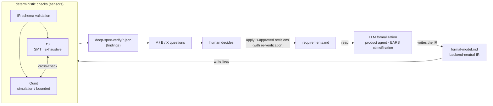
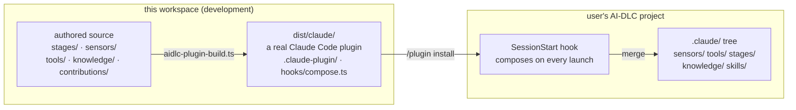

# How Deep Spec Analysis works

English | [日本語](architecture.ja.md)

An LLM formalizes the requirements document, solvers check it deterministically, and every discovery goes back to the human as a two-way choice — a neurosymbolic requirements-verification plugin added on top of [AI-DLC v2](https://github.com/awslabs/aidlc-workflows). Core is never modified.

- Plugin: `aidlc-deep-spec-analysis@aidlc-plugins`
- Backends: SMT (z3) + Quint
- Determinism: identical IR + identical environment ⇒ byte-identical output

## §1 The neurosymbolic loop

Probabilistic work (formalizing natural language) goes to the LLM; deterministic work (checking contradictions, completeness, scenarios) goes to the solvers. The hand-off point between the two is the backend-neutral IR, and verification results flow back into the requirements only through a human decision (A/B/X) — B-approved revisions are applied by the stage, re-verification included.



The requirements travel the loop once and come back to the human. Revisions answered B (adopt the proposed revision) are applied to `requirements.md` by the stage, which re-runs the sensors to confirm resolution. There are no unsanctioned rewrites — only human-approved text is ever applied, and the deterministic sensors themselves are read-only.

## §2 Where the stage runs

It is inserted into the Inception phase as the `deep-spec-analysis-verify` stage and proceeds in this order. The stage declares `scopes: [enterprise, feature]`, so it runs only for intents with those two scopes (a `classic`-scope intent routes it to SKIP — behavior confirmed against a real intent).

**Late adoption**: compose is additive, so installing into a project already running AI-DLC works mid-flight. Intents that predate the install can still have their existing requirements.md verified — without advancing the workflow — via `/aidlc --stage deep-spec-analysis-verify --single` (the same thing as the composed `/deep-spec-analysis-verify` skill). Findings are written under that intent's record. The only restriction is scope (classic is refused even in single mode). Furthermore, **spotting the verification debt is automatic**: right after install, the installer's coverage scan lists unverified intents with the exact command to run, and from then on `/aidlc --doctor` keeps printing an "N/M eligible intents verified" row plus advisory rows for unverified and stale intents (requirements changed after their last verification). This late-adoption path, detection included, is regression-tested on every run by `tests/intent-e2e.test.ts`.

1. **Formalize** — the product agent EARS-classifies each FR/NFR and writes the IR into a single JSON fence in `deep-spec-analysis-formal-model.md`.
2. **Sensors fire** — the write triggers three sensors in order: IR schema validation → SMT (z3) → Quint. Findings are written to `deep-spec-verify/*.json`.
3. **Human gate** — the stage converts findings into questions: **A.** keep as-is / **B.** adopt the proposed revision / **X.** other. Every finding waits for a human answer.
4. **Apply revisions** — the stage applies B-approved revisions to `requirements.md` (approved text only, verbatim), then re-runs formalization and the sensors to confirm resolution.
5. **Report** — `deep-spec-analysis-report.md` carries the coverage table (obligation × backend) and the applied revisions with before/after plus the second-pass verification result.

## §3 What is checked, what is promised

| Check | Content |
|---|---|
| Contradiction (conflict) | SMT exhaustively searches for combinations of requirements that cannot hold together |
| Completeness gap | Detects input regions whose behavior no requirement defines |
| Scenario violation | Both backends verify that expected scenarios hold, and cross-check each other's verdicts — surfacing formalization mistakes themselves |

No silent gaps: every obligation appears in the coverage table in exactly one of four states.

| State | Meaning |
|---|---|
| `checked` | Verified |
| `skipped` | Skipped with a reason |
| `unavailable` | Solver missing |
| `unverified` | Explicitly unverified |

Even without solvers the stage never stops; the situation degrades into advisory findings and `/aidlc --doctor` hints. Determinism is one of the promises: given the same IR and the same environment, output is byte-identical (fixed seeds, canonical sorting, no timestamps) — enforced byte-for-byte by the conformance tests.

## §4 Distribution — from build to compose

The build artifacts are "real host plugins", one per harness. On Claude Code you install it like any plugin, and a session-start hook composes it into the project's `.claude/` tree.



The shortest install is the bundled installer: `bun deep-spec-analysis/scripts/install.ts --project <project> [--harness claude]` runs build → compose in one go (store harnesses compose straight from `dist/` and copy nothing into the project; only the storeless Kiro / Kiro IDE / Cursor get the projection folder-dropped into the project root first, as those hosts expect. `--dry-run` validates in advance; compose is idempotent, so re-running is safe). Via a store, Claude Code uses `/plugin marketplace add` + `/plugin install aidlc-deep-spec-analysis@aidlc-plugins`; Codex CLI targets `dist/codex/` with `codex plugin marketplace add` + `codex plugin add aidlc-deep-spec-analysis@aidlc-plugins` (a one-time hook trust prompt; the hook fires lazily on the first interaction and composes into the `.codex/` tree). Harnesses without a store (Kiro, etc.) install by manual copy: `cp` the `dist/<harness>/` projection into the project and compose with `aidlc plugin sync` (or by running the hook's `compose.ts` directly under bun). Note that this path has no install-time trust gate — copying is itself the trust decision. Steps are in the [README](../README.md) Quickstart. Nothing is placed outside the project, and disabling the plugin recomposes back to vanilla — core stays unmodified.

## §5 The three-part workspace

The repository separates "where you build", "where the tooling comes from", and "where you try it".

```text
aidlc-deep-spec-analysis-plugin/
├── deep-spec-analysis/          # the plugin itself (authored source + tests + dist/)
│   ├── stages/ sensors/ tools/  # stage definitions · sensors · doctor
│   ├── tests/                   # byte-exact conformance suites
│   └── docs/decisions.md        # the canonical record of design decisions
├── aidlc-workflows/             # framework submodule — supplies validate/build/test; never edited
└── deep-spec-analysis-sandbox/  # compose-verification target (gitignored, disposable)
```

The entire toolchain is borrowed from the submodule: `aidlc-plugin-validate.ts` (convention checks) → `aidlc-plugin-build.ts` (emits to 7 harnesses) → `aidlc-plugin-test.ts --install` (a compose dry-run that never modifies the target).
